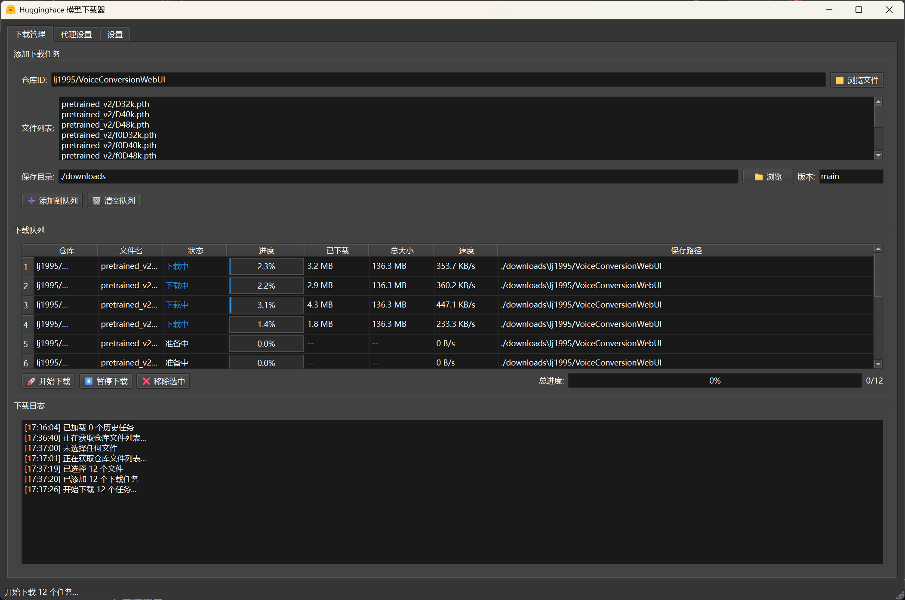
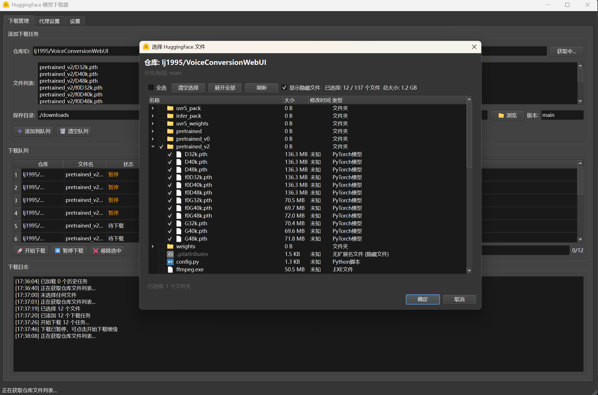

# HuggingfaceDownloader

## 项目简介

HuggingfaceDownloader 是一个基于 PyQt6 的图形界面工具，支持从 [Hugging Face](https://huggingface.co/) 平台批量下载模型文件，具备多线程、断点续传、代理设置、文件树可视化选择等实用功能，适合需要高效管理和下载 Hugging Face 资源的开发者和研究者。





---

## 主要特性

- 🚀 **多线程下载**：支持并发下载多个文件，提升下载效率。
- ⏸️ **断点续传与暂停**：下载中断后可继续，无需重复下载已完成部分。
- 🗂️ **文件树选择**：可视化浏览和多选仓库文件，支持文件夹结构展示。
- 🔍 **进度与日志**：实时显示每个任务的进度、速度、状态和详细日志。
- 🌐 **代理支持**：内置代理配置面板，支持 HTTP/HTTPS/SOCKS5 代理，适应不同网络环境。
- 💾 **任务持久化**：自动保存下载队列和进度，重启后可继续未完成任务。
- 🎨 **深色主题**：默认黑色UI，护眼美观。

---

## 安装方法

1. **克隆项目**

```bash
git clone https://github.com/HeMOua/HuggingfaceDownloader.git
cd HuggingfaceDownloader
```

2. **安装依赖**

Python版本 3.10

```bash
pip install uv

uv sync
```

---

## 使用说明

### 1. 启动程序

```bash
uv run main.py
```

### 2. 界面操作流程

- **仓库ID**：输入 Hugging Face 仓库名（如 `microsoft/DialoGPT-medium`）。
- **浏览文件**：点击“🗂️ 浏览文件”弹出树状文件选择器，支持多选。
- **文件列表**：可手动输入或自动填充所需文件名（每行一个）。
- **保存目录**：选择本地保存路径。
- **版本**：填写分支或标签（如 `main`）。
- **添加到队列**：将任务加入下载队列。
- **开始下载/暂停下载**：支持批量启动、暂停、断点续传。
- **代理设置**：在“代理设置”选项卡中配置代理，支持多种协议和认证。
- **设置**：可调整并发数、重试次数等参数。
- **日志与进度**：底部实时显示下载日志和整体进度。

### 3. 任务管理
- 支持批量移除、清空队列。
- 任务状态自动保存，关闭程序后下次启动可继续未完成任务。

---

## 依赖环境

- Python >= 3.13
- huggingface-hub >= 0.33.4
- PyQt6 >= 6.9.1
- requests >= 2.32.4

---

## 常见问题与FAQ

### Q1: 下载失败/超时怎么办？
- 检查代理设置，确保网络可访问 Hugging Face。
- 可在“设置”中增加重试次数。
- 查看日志区详细错误信息。

### Q2: 如何配置代理？
- 进入“代理设置”选项卡，勾选“启用代理”，填写类型、地址、端口（如 `127.0.0.1:7890`），如需认证填写用户名密码。
- 可点击“测试连接”验证代理可用性。

### Q3: 支持哪些文件类型？
- 支持 Hugging Face 仓库内所有文件，支持多选、文件夹结构浏览。

### Q4: 断点续传如何实现？
- 程序自动检测本地已下载部分，支持断点续传，无需手动操作。

### Q5: 任务会丢失吗？
- 任务队列和进度自动保存到本地，重启后可继续。

---

## 致谢与参考

- [Hugging Face Hub](https://huggingface.co/docs/huggingface_hub)
- [PyQt6 官方文档](https://doc.qt.io/qtforpython-6/)

---

如有建议或问题，欢迎 Issue 或 PR！
